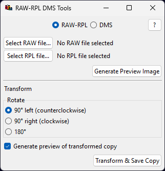
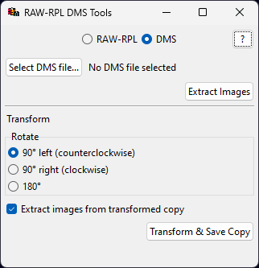

# RAW-RPL DMS Tools

[macOS](#macos) · [Windows](#windows) · [Python](#developers)


User interface to manipulate RAW-RPL (Ripple) file pairs and Datamuncher DMS files containing MA-XRF spectral data.

 

Built with Python and a modified, stripped-down version of [`maxrf4u`↗](https://github.com/fligt/maxrf4u) package by [Frank Ligterink↗](https://github.com/fligt).

Features:

- Rotate 90°, –90°, and 180°
- Generate preview images from RAW-RPLs
- Extract elemental distribution images from DMSs

## Download and run

Run as [Windows executable](#windows), a [macOS package](#macos), or directly with [Python](#developers).

### Windows

For Windows, RAW-RPL DMS Tools is available as a portable, no-install executable that runs directly by double-clicking or running from the command prompt:

1. [Download the latest Windows version](https://github.com/olive-groves/raw-rpl-dms-tools/releases/latest) under `raw-rpl-dms-tools_vx.y.z_win64_portable.exe.zip`

2. Extract `raw-rpl-dms-tools_vx.y.z_win64_portable.exe` from the ZIP.
   
3. Double-click the extracted `raw-rpl-dms-tools_vx.y.z_win64_portable.exe`.

4. **Wait up to 30 seconds** for RAW-RPL DMS Tools to open.

> [!NOTE]
> Windows Defender SmartScreen might block you from running the executable via double-click. Try:
> - [Open without Windows Defender SmartScreen](#open-without-windows-defender-smartscreen)

### macOS

For macOS, RAW-RPL DMS Tools installs to your computer with an app file which you drag into Applications. The app can then be started directly from Launchpad:

1. [Download the latest macOS version](https://github.com/olive-groves/raw-rpl-dms-tools/releases/latest) under `raw-rpl-dms-tools_vx.y.z_macOS.app.zip`

2. In Finder, extract `raw-rpl-dms-tools_vx.y.z_macOS.app` from the ZIP.

3. Drag `RAW-RPL DMS Tools` into Applications.

4. Go to Applications (***not* Launchpad**). 

5. In Applications, control-click (right-click) on RAW-RPL DMS Tools, then click Open.

> [!NOTE]
> macOS might block you from running the package. Try:
> - [Open a Mac app from an unknown developer↗](https://support.apple.com/guide/mac-help/open-a-mac-app-from-an-unknown-developer-mh40616/mac)
[](https://support.apple.com/guide/mac-help/open-a-mac-app-from-an-unknown-developer-mh40616/mac)


## Developers

RAW RPL Tools runs on Python 3.14 with just a couple dependencies in `pyproject.toml`.

### Install and run

Once cloned, you can use Poetry to install the dependencies:

```bash
poetry install
```

And then run with:

```bash
poetry run python ./src/raw_rpl_dms_tools/main.py
```

> #### `conda`
> 
> If you use `conda` (Anaconda), I recommend manually creating a Python environment instead of solving from `environment.yml`.
> 
> Change directory to the repo root and run these commands to manually create the environment in `./env`:
> 
> ````
> conda create -y --prefix ./env python=3.14 --force
> conda activate ./env
> pip install poetry -y
> poetry install
> ````
>
> To activate the environment in the future, change directory to repo root and run `conda activate ./env`. 

### Compiling with `pyinstaller`

Windows portable executable:
```
cd .\src\raw_rpl_dms_tools
pyinstaller --onefile --windowed --recursive-copy-metadata raw_rpl_dms_tools --icon=icon.ico --add-data=C:\art\raw-rpl-dms-tools\src\raw_rpl_dms_tools\icon.ico:. .\main.py
```

macOS package:
```bash
cd src/raw_rpl_dms_tools
poetry run pyinstaller --onefile --windowed --recursive-copy-metadata raw_rpl_dms_tools --icon=icon.icns --add-data=/Users/max/Developer/git/raw-rpl-tools/src/raw_rpl_dms_tools/icon.icns:. main.py -y 
```


## Credits

Created by Lars Maxfield

maxrf4u Copyright (c) 2026 Frank Ligterink with modifications by Lars Maxfield

Icon ['Rubik cube cubes game'↗](https://icon-icons.com/icon/rubik-cube-cubes-game-toy/225301) by Icon-Icons.


## Questions

### Open without Windows Defender SmartScreen


#### Run option 1: With admin privileges

If you have admin privileges:

1. Double-click on `raw-rpl-dms-tools_vx.y.z_win64_portable.exe`.
2. On the Windows Defender SmartScreen pop-up, select **More info**.
3. Select **Run anyway**. _No **Run anyway**? Select **Don't run** and [try Option 2.](#run-option-2-without-admin-privileges)_
4. Wait for RAW-RPL DMS Tools to open. This may take a few seconds.

#### Run option 2: Without admin privileges

If double-clicking the executable doesn’t work, try running it via the command prompt.

>*Not possible? You can try running on a virtual machine or contacting your machine admin.*

You can find various ways online on how to run an executable via the command prompt, but I prefer these steps:

1. Copy the path of the executable:
   - **Right-click** the file. (On Windows 10, press and hold the `Shift` key and then **right-click** the file.)
   - Select **Copy as path**.

2. Open the Start menu  (`⊞ Win`).
3. Type **cmd**.
4. Press the `Enter` key or select the Command Prompt app.
5. Paste into the prompt the executable path you copied with `Ctrl·V`.
6. Run by pressing `Enter`. 
7. Wait for the executable to load. This may take a few seconds.
