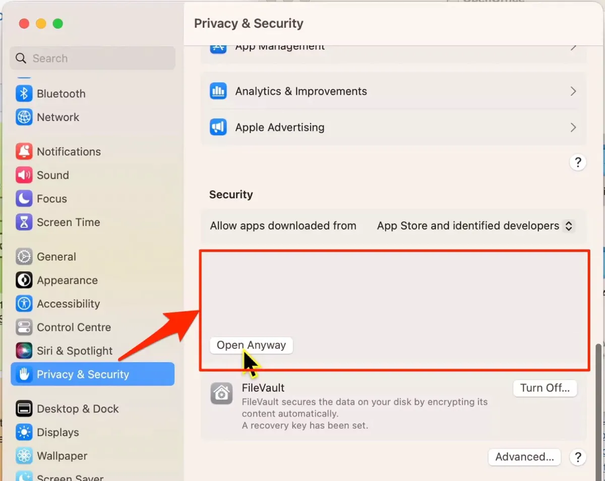
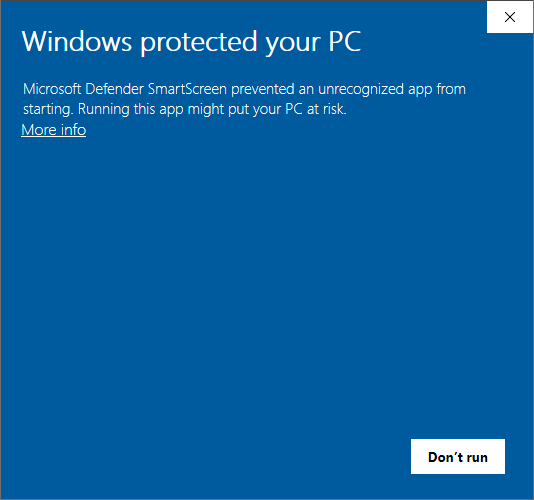

# RAW-RPL DMS Tools

User interface to manipulate RAW-RPL (Ripple) file pairs and Datamuncher DMS files containing MA-XRF spectral data.

Built with Python and a modified, stripped-down version of [`maxrf4u`↗](https://github.com/fligt/maxrf4u) package by [Frank Ligterink↗](https://github.com/fligt).

Available for macOS and Windows at just under 20 MB.

TODO: Screenshot


## TODO: Download and run

### Windows

> [!NOTE]
> Windows Defender SmartScreen might block you from running the executable via double-click. Try:
> - [Open without Windows Defender SmartScreen](#open-without-windows-defender-smartscreen)

### macOS

> [!NOTE]
> macOS might block you from running the package. Try:
> - [Open a Mac app from an unknown developer↗](https://support.apple.com/guide/mac-help/open-a-mac-app-from-an-unknown-developer-mh40616/mac)
[](https://support.apple.com/guide/mac-help/open-a-mac-app-from-an-unknown-developer-mh40616/mac)


## TODO: Features

### Preview

### Rotate

## TODO: Developers

RAW RPL Tools runs on Python 3.14 with a just a couple [dependencies](#dependencies).

### Dependencies

### Install

```bash
poetry install
```


### Windows executable

```
cd .\src\raw_rpl_dms_tools
pyinstaller --onefile --windowed --recursive-copy-metadata raw_rpl_dms_tools --icon=icon.ico --add-data=C:\art\raw-rpl-dms-tools\src\raw_rpl_dms_tools\icon.ico:. .\main.py
```

### macOS package

```bash
cd src/raw_rpl_dms_tools
pyinstaller --onefile --windowed script.py -y 
```


## TODO: Credits

Created by Lars Maxfield

maxrf4u Copyright (c) 2026 Frank Ligterink with modifications by Lars Maxfield

Icon ['Rubik cube cubes game'↗](https://icon-icons.com/icon/rubik-cube-cubes-game-toy/225301) by Icon-Icons.


## Questions

### Open without Windows Defender SmartScreen



#### Run option 1: With admin privileges

If you have admin privileges:

1. Double-click on `pdz-extractor_vx.y.z_win64_portable.exe`.
2. On the Windows Defender SmartScreen pop-up, select **More info**.
3. Select **Run anyway**. _No **Run anyway**? Select **Don't run** and [try Option 2.](#run-option-2-without-admin-privileges)_
4. Wait for PDZ Extractor to open. This may take a few seconds.

#### Run option 2: Without admin privileges

If double-clicking the executable doesn’t work, try running it via the command prompt.

>*Not possible? You can try running on a virtual machine or contacting your machine admin.*

You can find various ways online on how to run an executable via the command prompt, but I prefer these steps:

1. Copy the path of the executable:
   - **Right-click** the file. (On Windows 10, press and hold the `Shift` key and then **right-click** the file.)
   - Select **Copy as path**.

2. Open the Start menu  (`⊞ Win`).
3. Type **cmd**.
4. Press the `Enter` key or select the Command Prompt app.
5. Paste into the prompt the executable path you copied with `Ctrl·V`.
6. Run by pressing `Enter`. 
7. Wait for the executable to load. This may take a few seconds.
